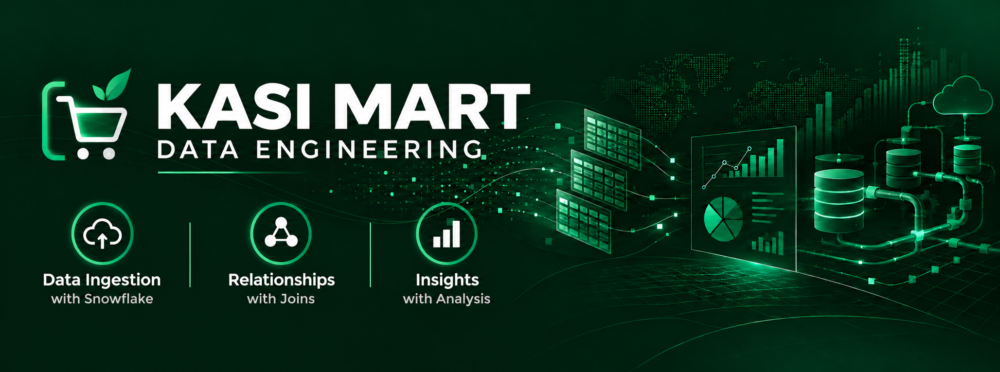

<p align="center">
  
</p>

## Project Overview 📋

Kasi Mart is a project based on a small retail business that sells everyday products to customers across different provinces in South Africa. The business serves customers looking for affordable and convenient products across different areas.

This business sells products across four main categories:
📱 Electronics — electronic devices and accessories
🏠 Home — products for everyday household use
👕 Fashion — clothing and fashion-related products
💄 Beauty — personal care and beauty products

The purpose of the project is to take these separate datasets and build relationships between them so that the business can use its data to answer basic questions about its customers, products and orders.

As a data engineer, my focus  will be to learn data inspection, data ingestion, table relationships, SQL joins and basic business analysis using Snowflake.
The SQL work is completed entirely in Snowflake to give me practical experience working with a cloud-based data platform.


##  Repository Structure 📁

```text
kasi-mart-data-engineering/
│
├── 01_business_context/
│   └── 01_business_context.md
│   └── 02_data_inspection.md
│
├── 02_datasets/
│   ├── customers.csv
│   ├── products.csv
│   └── orders.csv
│
├── 03_snowflake/
│   ├── 01_table_creation.sql
│   ├── 02_data_loading.sql
│   ├── 03_data_validation
│   
│
├── 04_analysis/
│   └── business_questions.sql
│
├── 05_assets/
│   ├── banner.png
│   └── screenshots/
│
├── 06_websites/
│   ├── kasi-mart-website
│   └── data-engineering-knowledge-hub
│
└── README.md
```

## Basic Analysis 📊

After building the tables and establishing the relationships, I used SQL to bring the customer, product, and order data together and answer four basic business questions.

The analysis focused on:

* Joining every order to the customer name, product name, and product category
* Calculating line_revenue using quantity × unit_price
* Calculating total revenue per customer
* Calculating total revenue per product category
* Identifying the Top 5 customers by total spend

The purpose was to practise using SQL joins, calculated fields, aggregation, and ranking to turn the Kasi Mart data into basic business insights.


## Tools Used 🛠️

<div align="center">


</div>


## Project Websites 🌐 

I also went beyond the core assignment and created two small websites using the Kasi Mart scenario.

#### Kasi Mart Store 🛒
A fun retail-style website created around the Kasi Mart business.
Live Website: https://kasi-mart-data-engineering.vercel.app/


#### Data Engineering Learning Hub 📚 
A learning website explaining some of the data engineering concepts I worked with during the project, using the Kasi Mart scenario.
Live Website: https://kasi-mart-data-engineering-afdu.vercel.app/


## What I Learned 🚀

This project helped me understand how data moves from raw CSV files into a cloud data platform, how tables are connected, and how SQL can be used to answer business questions.
It also gave me practical experience using Snowflake, Git, GitHub and Vercel in one project.

